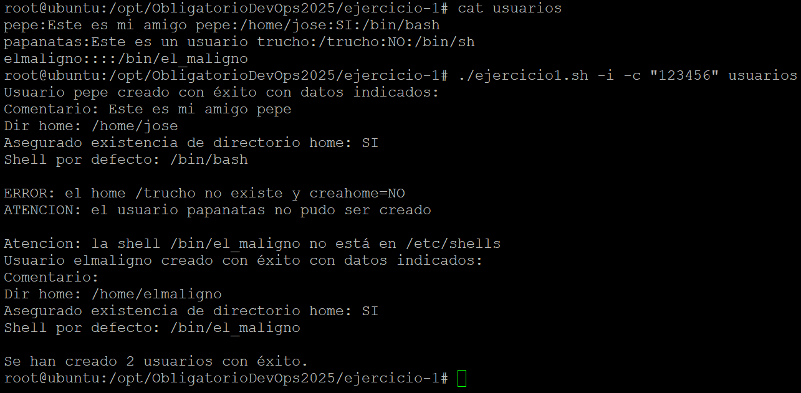
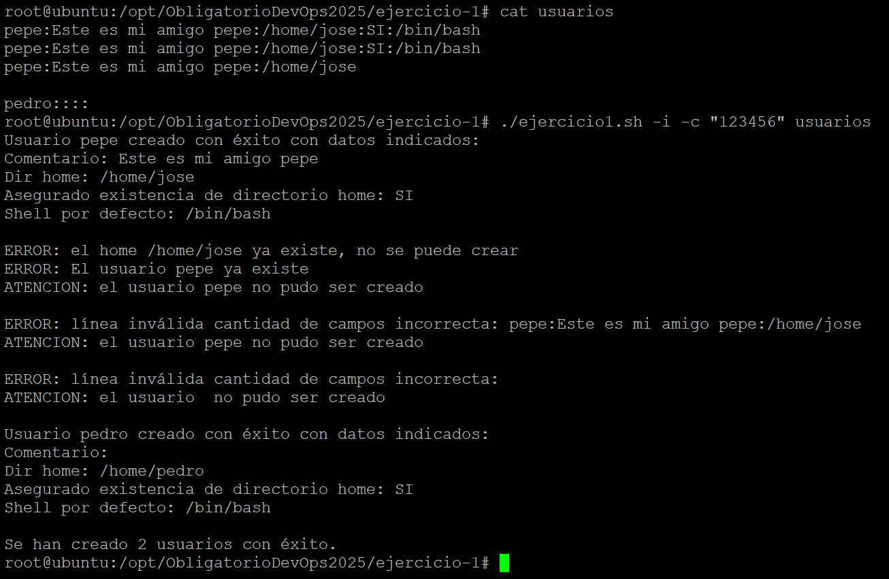
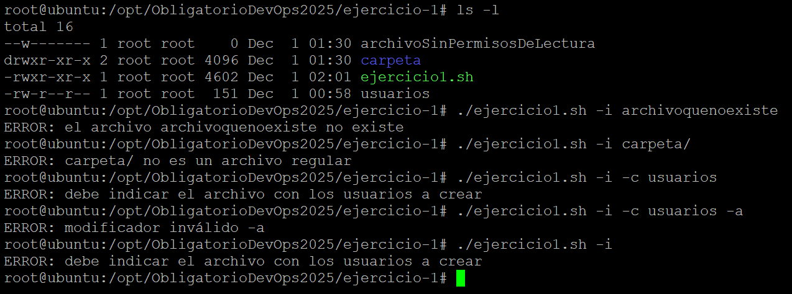
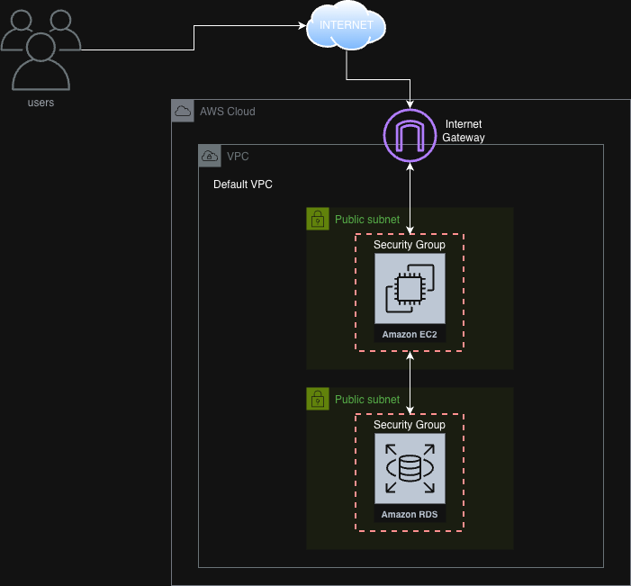
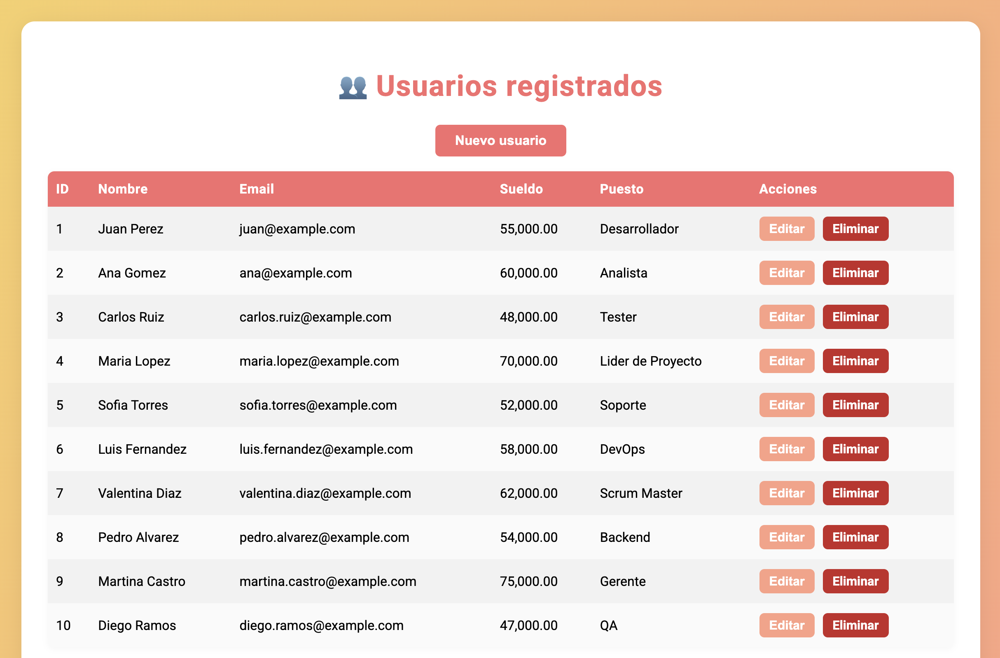

# Ejercicio 1

Este ejercicio consiste en un **script bash automatizado** para la creación de usuarios en Linux.
El objetivo es validar datos, manejar errores y asegurar la creación correcta de cuentas de usuario siguiendo las reglas definidas en la letra del obligatorio.

---

## 📦 Requerimientos de ejecución
Para ejecutar el script correctamente se deben cumplir los siguientes requisitos:

- El script debe tener permisos de ejecución.
- Debe ejecutarse como **superusuario (root)**.
- Debe existir el archivo con los usuarios y debe especificarse como parámetro.
- El archivo de entrada debe ser:
  - Un archivo **regular** (`-f`)
  - **Legible** (`-r`)

---

## 📝 Descripción del script

El script permite crear usuarios en Linux tomando como entrada un archivo donde cada línea representa un usuario y sus atributos.

El script:
- Valida la estructura de cada línea.
- Aplica valores por defecto cuando faltan datos.
- Permite definir una contraseña común mediante el parámetro `-c`.
- Muestra información del procesamiento mediante `-i`.
- Controla errores y situaciones especiales:
  - Usuario ya existente
  - HOME ya existente
  - Cantidad incorrecta de campos
  - Líneas vacías
  - Archivo inexistente o sin permisos
  - Parámetros inválidos o insuficientes

Ruta absoluta del script:
```
/ObligatorioDevOps2025/ejercicio-1/ejercicio1.sh
```

---

## ▶️ Parámetros disponibles

| Parámetro | Descripción |
|----------|-------------|
| `-i` | Muestra información detallada durante la ejecución |
| `-c <password>` | Asigna una contraseña común a todos los usuarios creados |

---

## 📄 Caso de prueba del obligatorio

Ejemplo de archivo de entrada y validaciones realizadas por el script:


---

## 🧪 Ejemplo de ejecución real



---

En los casos de prueba se validan situaciones como:
- Intento de crear un usuario existente
- Crear usuario con HOME ya existente (y opción de crearlo)
- Campos incompletos
- Líneas vacías
- Archivo inválido o sin permisos
- Parámetros incorrectos
- Uso de valores por defecto



---

También se verifican otros controles solicitados en la letra del obligatorio:



---

## ✔️ Conclusión

Este ejercicio demuestra:
- Manejo de errores
- Validación completa de entradas
- Uso apropiado de funciones del sistema Linux
- Automatización del alta de usuarios

# Ejercicio 2

Este ejercicio consiste en un script de aprovisionamiento de infraestructura en AWS, hecho con python usando el SDK de AWS "Boto3". El objetivo es desplegar automáticamente una arquitectura completa utilizando **Python**, **Boto3**, **Amazon EC2**, **Amazon RDS**, **AWS Systems Session Manager** y **Security Groups**.

En el repositorio encontraras que el ejercicio se divide en 2 secciones.

app/: Aqui encontraras todos los archivos necesarios para el funcionamiento de la aplicacion.
despliegue-app: Aqui se encuentra el script de aprovisionamiento.

---
## 🖼️ Diagrama de la Arquitectura
A continuación se muestra el diagrama visual de la infraestructura desplegada automáticamente por el script:



---
## 📦 Requerimientos
Para ejecutar el script correctamente necesitas:
- Python 3.10 o superior
- AWS CLI v2 instalado y configurado
- Credenciales temporales o permanentes exportadas en el entorno
- Paquete de Python: boto3 (incluido en requirements.txt)

---
## ⚙️ ¿Qué hace el script `ejercicio-2.py`?
El script automatiza **todo** el despliegue de la infraestructura necesaria para la aplicación web.

### 🔹 1. Carga las credenciales AWS desde el entorno
El script usa las variables:
- `AWS_ACCESS_KEY_ID`
- `AWS_SECRET_ACCESS_KEY`
- `AWS_SESSION_TOKEN`
- `AWS_DEFAULT_REGION`

Esto es necesario para autenticarse contra AWS, de otra manera el script no funcionaria.

### 🔹 2. Genera nombres únicos mediante un sufijo aleatorio
Esto permite ejecutar el script múltiples veces sin conflictos:
- `SG-webserver-xxxxxx`
- `SG-bd-xxxxxx`
- `dbwebserver-xxxxxx`

### 🔹 3. Crea los Security Groups
- **SG del WebServer**: expone **80 y 443** al internet.
- **SG de la Base de Datos**: sólo permite tráfico del SG del WebServer.

Ambos SG quedan etiquetados con:
```
Proyecto = ObligatorioDevOps
```

### 🔹 4. Crea la instancia RDS MySQL
- Usa la DB `dbwebserver`
- Genera password aleatorio seguro para el usuario admin
- Espera a que la instancia esté en estado `available`
- Obtiene el endpoint final
- Etiquetada con el tag del proyecto

### 🔹 5. Crea la instancia EC2 Amazon Linux 2023
- Instala Apache, PHP y MySQL Client
- Instala SSM Agent
- Expone la IP pública
- Etiquetada con el tag del proyecto

### 🔹 6. Sube los archivos de la aplicación vía SSM
Los archivos se envían desde el repositorio local a la instancia EC2 mediante `AWS-RunShellScript`.

### 🔹 7. Inicializa la base de datos
Ejecuta automáticamente:
```
mysql -h {db_endpoint} -u {db_username} -p{db_password} dbwebserver < /var/www/init_db.sql
```

### 🔹 8. Crea el archivo `.env`
Conecta la aplicación a RDS:
```
DB_HOST=endpoint de rds
DB_NAME=nombre de la base de datos
DB_USER=usuario de la base de datos
DB_PASS=contrasena de la base de datos
```

### 🔹 9. Reinicia Apache
Deja la aplicación operativa y accesible.

### 🔹 10. Muestra un resumen final
Incluye:
- IDs de SGs creados
- ID de EC2
- Nombre de instancia RDS
- IP pública
- URL de acceso
```
http://<IP_PUBLICA>/login.php
```

---
## ▶️ ¿Cómo ejecutar el script?
### 1. Crear entorno virtual
```
python3 -m venv venv
source venv/bin/activate
```

### 2. Instalar dependencias
```
pip install -r requirements.txt
```

### 3. Exportar credenciales AWS
```
export AWS_ACCESS_KEY_ID=...
export AWS_SECRET_ACCESS_KEY=...
export AWS_SESSION_TOKEN=...
export AWS_DEFAULT_REGION=us-east-1

Tambien se puede modificar ~/.aws/credentials y pegar los accesos ahi.
```

### 4. Ejecutar
```
python ejercicio-2.py
```
---
## 🏷️ Uso de Tags
Todos los recursos creados (EC2, SG, RDS) incluyen:
```
Proyecto = ObligatorioDevOps
```
Esto permite:
- Filtrar recursos en AWS
- Identificar qué pertenecen al la infaestructura aprovisionada para el obligatorio
- Facilitar limpieza final
---
## ✨ Conclusión
Este ejercicio implementa un despliegue *end-to-end* profesional utilizando:
- Infraestructura como código en Python/Boto3
- Prácticas de seguridad
- Automatización completa
- Aplicación web funcional

---
## ⚠️ Consideraciones importantes

- El script **no elimina** la infraestructura creada.
  Cualquier recurso aprovisionado (EC2, RDS, SG, etc.) debe ser eliminado manualmente desde la consola o con AWS CLI.

- El script **no crea una VPC dedicada**.

---
## 🖥️ Vista de la aplicación web desplegada
A continuación se muestra una captura real del sistema web funcionando sobre la infraestructura aprovisionada:


